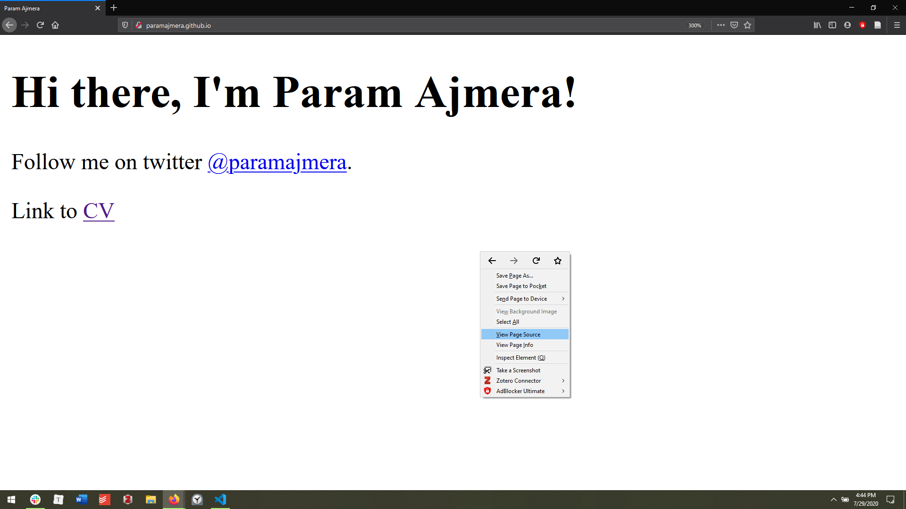
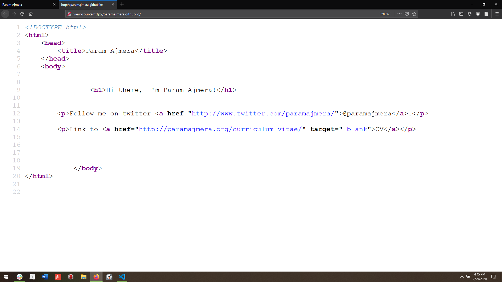

← [Introduction](01-introduction.md)&nbsp;&nbsp;&nbsp;|&nbsp;&nbsp;&nbsp;[Basic Template for HTML](03-basic-template-for-html.md) →

---

# 2. Opening Activity

**_Note_: please use Firefox or Chrome. Safari will not allow you to complete this activity.**

1. Open a web browser, preferably [Firefox](https://www.github.com/DHRI-Curriculum/install/blob/v2.0/guides/firefox.md).
2. Go to any website. The example below is from [paramajmera.github.io](http://paramajmera.github.io/).
3. Open the secondary menu (using a mouse, this would be the menu that opens when you right click on the page; on Mac computers, this is usually a two-finger tap on the track pad, or you can press the <kbd>control</kbd> button then click the track pad).
4. Select `View Page Source` from the dropdown menu.

## What You Are Seeing

A second tab should open in your browser displaying the underlying code of the page. This is the code that is used to make and render the page in your web browser.

In this workshop, we are going to learn how to read and write this code, and render it in the browser on your local computer. At the end we will discuss the next steps for how you could host your new website, making it available for browsing by others via the internet.

---

← [Introduction](01-introduction.md)&nbsp;&nbsp;&nbsp;|&nbsp;&nbsp;&nbsp;[Basic Template for HTML](03-basic-template-for-html.md) →