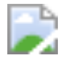

[<<<Back](links.md) | [Next>>>](conventions.md)

# Images

Images are another important component of websites. Sometimes these just help bring your website to life, but other times they can help communicate information to users. 

Images are created with the `` tag. Similar to the `<a>` tag, `` requires an attribute, in this case `src`. The `src` attribute stands for source and communicates secondary information to your browser that identifies and locates the image. Unlike many other tags, the `` tag does not need to be closed, making it an example of a void tag.

The following element pulls in an image located in the same folder as the `.html` file:

```html

```

The same rules apply here as with the `href` tag: if the image is not located in the same folder as the document you are writing in, the image will not be found by the browser. If the browser cannot find an image resource, you will see a broken image icon, such as this one from Chrome:



## Making images accessible

Alternative text, or alt text, is descriptive "text associated with an image that serves the same purpose and conveys the same essential information as the image" [Wikipedia Manual of Style/Accessibility/Alternative Text for Images](https://en.wikipedia.org/wiki/Wikipedia:Manual_of_Style/Accessibility/Alternative_text_for_images), and is important for ensuring content conveyed by images is accessible to all.  

To add alternative text to an image, you add an additional attribute, `alt` followed by your descriptive text. For example:

```html

```

For more information, see what the [Social Security Administration](https://www.ssa.gov/accessibility/files/SSA_Alternative_Text_Guide.pdf) has to say. 

## What images can I use on my site?

If you're planning to use images that you did not take or make yourself, you'll need to use "public domain" or "open license" images. 

This [guide by the OpenLab at City Tech](https://openlab.citytech.cuny.edu/blog/help/following-copyright-guidelines-for-images/) includes more information on licensure and a list of places where you can find reuseable images. 

## Activity

Download and save an image from the web, or move an image from your computer into the same folder as your `index.html` file.

Tip: Give the file a simple name. Also, the name **cannot** have spaces.

Using the code above as a reference, add that image into your `index.html` file, re-save the file, and re-open or refresh the page in your browser. Your image should now appear on the page.

[<<<Back](links.md) | [Next>>>](conventions.md)
