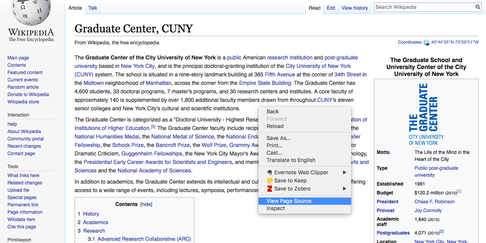

[<<<Back](introduction.md) | [Next>>>](basic.md)

# Opening Activity

1. Open a web browser
2. Go to any webpage
3. Open the secondary menu (using a mouse, this would be the menu that opens when you right click on the page; on Mac computers, this is usually a two-finger tap on the track pad, or you can press the "control" button then click the track pad).
4. Select ‘View Page Source’ from the dropdown menu. 

What do you see?

## What Should you see? 

A second page should open in your browser, and that page should display the underlying code of the page. This is the code that is used to make and render the page in your web browser. 

Through this workshop, we are going to learn how to read and write this code, and render them in the browser on your local computer. At the end we will discuss the next steps for how you could get your text files to render a website on the Internet. 

[<<<Back](introduction.md) | [Next>>>](basic.md)
