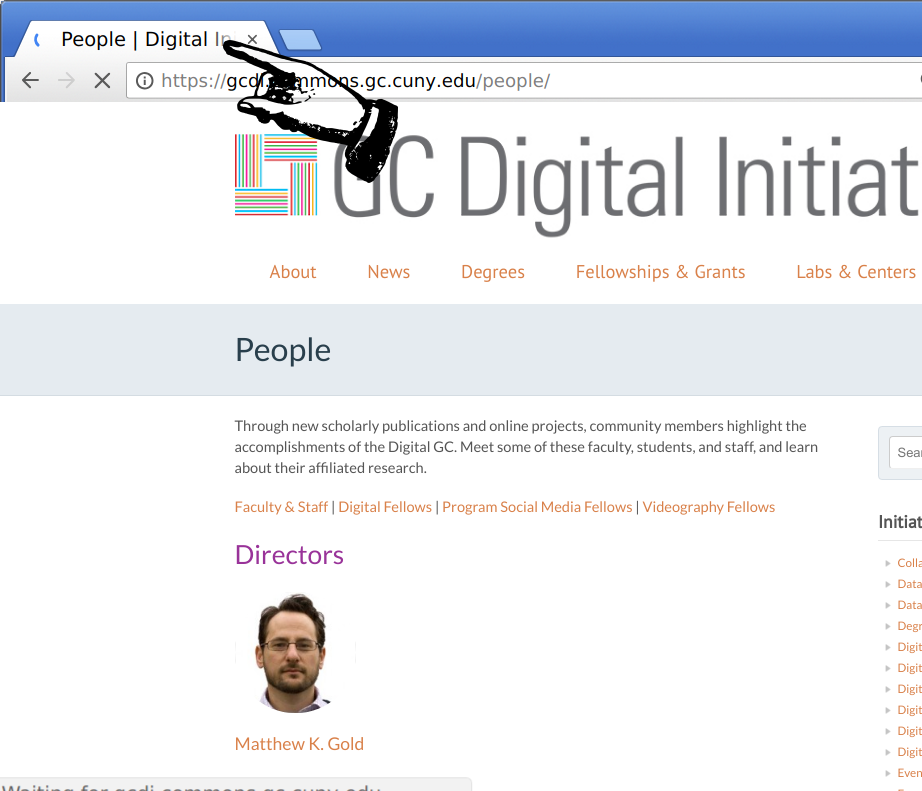
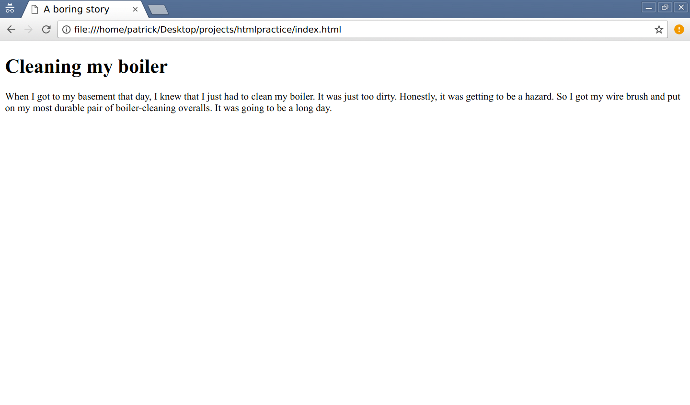

[<<<Back](elements.md) | [Next>>>](links.md)

# Paragraphs and Headings

Paragraphs and headings are the main textual elements of the body of your webpages. Because these contain content that you want to organize and display on your webpage, these are entered in the body element. 

The `<h1>`, `<h2>`, `<h3>`, etc tags denote **headings** and **subheadings**, `<h1>` being the largest.

The `<p>` tags denote **paragraphs**, or blocks of text.

```html
<!DOCTYPE html>
<html lang="en">

<head>
	<title>A boring story</title>
</head>

<body>
	<h1>
		Cleaning my boiler
	</h1>
	<p>
	When I got to my basement that day, I knew that I just had to clean my boiler. It was just too dirty. Honestly, it was getting to be a hazard. So I got my wire brush and put on my most durable pair of boiler-cleaning overalls. It was going to be a long day.
	</p>
</body>

</html>
```
Note that the `<title>` is in the `<head>` element, which is where information about the webpage goes. The title doesn't appear on the page, but instead elsewhere in the browser when the page is displayed. For example, in Chrome, the title appears on the tab above the navbar.



## Activity

Using your text editor, add the following to your `index.html`:

- Title
- Heading
- Paragraph 

Then, re-save the file. Open it in your browser again or refresh the page if still opened. 

What do you notice about how the information is organized in the webpage? In other words, where are the title, heading, and paragraph text?

## What should you see? 
The heading should appear at the top of the page, followed by the paragraph text. The heading text should be larger. The title should appear in the browser window tab. 



[<<<Back](elements.md) | [Next>>>](links.md)
